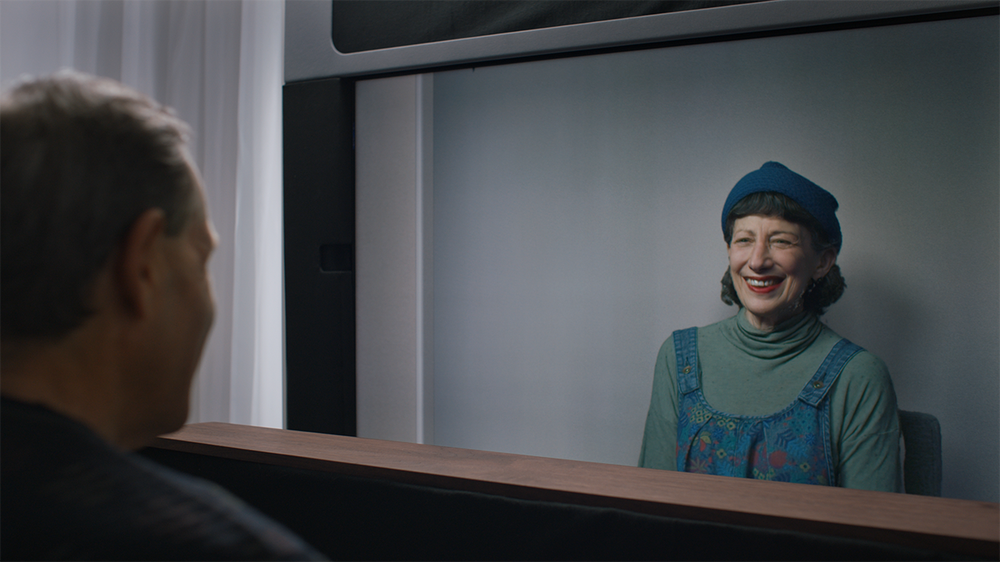
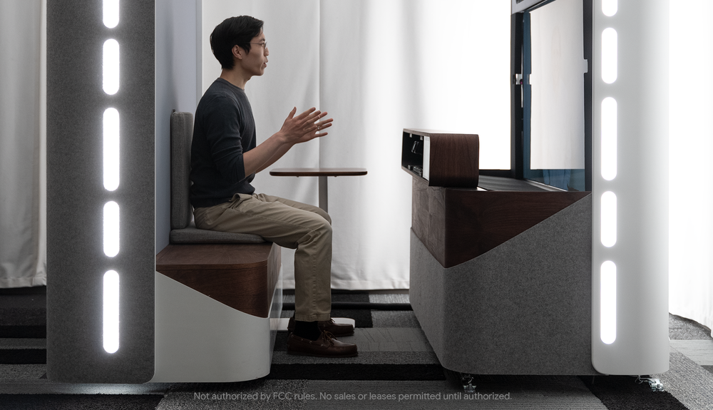

### meta info
- paragraph: 11
- word count: 458

### translation

> 人們都喜歡有人作伴，不管是分享所見、合作解決問題，又或是單純的交心對話。陪伴在今年顯得格外得重要，從前的外出旅遊現在卻只能待在家裏，遠程工作更是未來的趨勢。

> 近年來，我們製作了許多能夠幫助人們互相連接的產品。我們不僅簡化了 Gmail 使用戶能夠更輕鬆地分享 Google Photos 上的相片，而且還使用戶在使用 Google Meet 能夠更高效。但是，不管我們如何改善這些產品，又或是其他新型的溝通工具，這些都沒法跟面對面的交流相提並論。

> 這樣未解決的的問題在我們看來是萬分重要的。我們捫心自問：我們能夠通過科技來模擬那種近乎是面對面的感覺嗎？

> 我們的答案是星鏈計劃<small>(實際上我們已將在這方面努力有好幾年了)</small>。我們利用了近年來軟件及硬件上高速的進展，使不管是朋友同事或是家人之間，在使用時都可以得到雙方彷彿真的是在面對面一般的感覺，即使他們之前可能相隔了幾個大洲。

> 想象下我們往鏡子看去，你看到的不是你的鏡像，而是 1:1 真實比例、超乎視頻通話的 3D 視覺體驗。對方彷彿就真的和你在同一個屋子裏，手勢或是眼神上的交流更不在話下。

> 爲了使這種體驗稱爲可能，我們應用了來自各領域的研究：計算機視覺、機器學習、空間音頻以及實時壓縮。與此同時，我們還開發出了一個突破性的光場現實系統，你在不需要任何額外設備的情況下就能夠體驗到三維空間的視覺效果。

> 將這些技術合併在一起，你得到的就是身臨其境、和你對話的人彷彿就和你在同一個屋子里的感覺。

> 我們最自豪的是，當你一旦坐下開始溝通時，所有相關的 UI 畫面都會完全隱藏，這樣你就能夠完全專注在你面前的人。

> 當前星鏈計劃只在我們的幾間辦公室有部署，高度定製且專門的硬件更是不可或缺。我們始終堅信：與人與人交流相關的科技，這應該是我們該走的方向；我們最終的目標是使這項科技變得更普及、更易於使用，與此同時也將這些進步帶給我們其他的溝通工具中。

> 我們已在谷歌內部測試了上千個小時，包括使在不同城市的同事互相溝通，如舊金山灣區、紐約以及西雅圖。我們還向一些醫療及媒體領域的企業示範我們的進展，以得到儘可能多的反饋包括其實際應用領域。年底我們計劃在企業內實地部署。

> 我們對目前取得的進展以及這項科技的潛力十分興奮。我們期待今年晚些時候分享更多關於此項目的信息。

-----

### footnote
1. 演示視頻 on [Youtube](https://www.youtube.com/watch?v=Q13CishCKXY)
2. 相關討論 on [Hacker News](https://news.ycombinator.com/item?id=27199330)
3. 舊金山灣區與紐約距離大致有 4660 公里，與西雅圖大致有 1282 公里。

