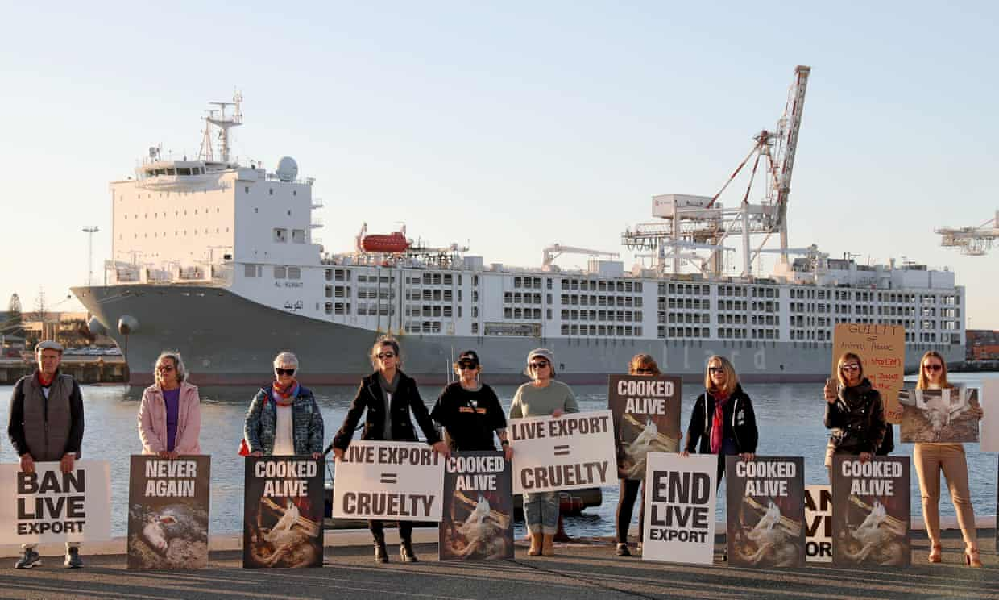
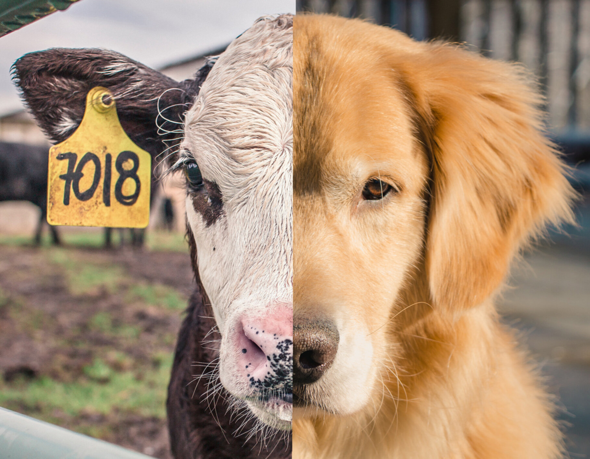
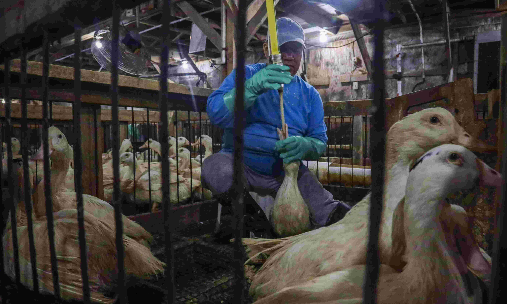
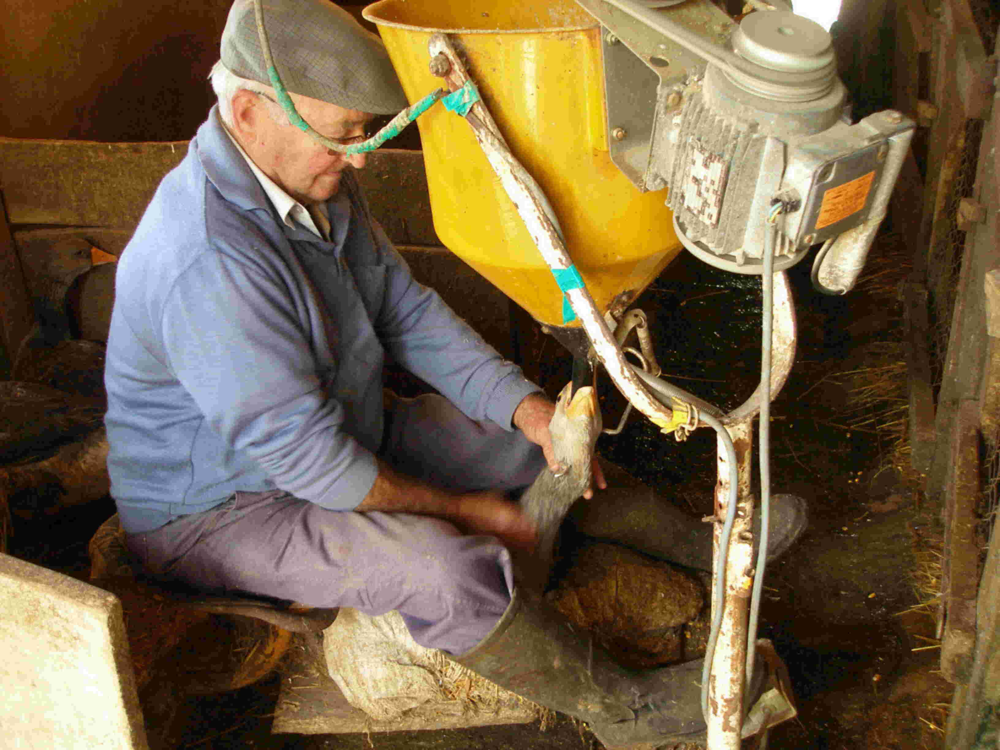

### meta info

- paragraph: 13
- word count: 692

### translation

> 動物將首次在英國法律中被正式承認爲有感情的生物。英國政府制定了一系列相關的措施，例如停止多數活體動物出口以及徹底禁止涉及战利品狩猎的進口，這不得不說是動物保護人士的一大勝利。

> 這些改革將會通過一系列的法案來實施。其中有一項法案覆蓋面廣至農場及人們家里的寵物；另外還有針對國外的動物保護法案，主要是通過禁止象牙、鲨鱼鳍的交易來實現，通過過度餵養製成的肥鹅肝也在可能被禁的列表上。

> 這些看起來突然的措施實則不然。在貓咪皮膚內嵌入芯片、阻止人們將靈長類動物作爲個人寵物，這些都已經在幕後準備了多年，另外出口活體動物更是論世紀爲尺度的抗爭主題。

> 環境部長 喬治・尤斯蒂斯 <small>(George Eustice)</small> 說道：“我們是一個熱愛動物的國家，我們也是第一個通過動物福利法的國家。我們將會通過實際行動兌現我們的承諾：例如禁止出口用於屠宰以及過度增肥的活體動物，禁止將靈長類動物作爲家庭寵物，以及引入新的法規來管制走私幼犬。鑒與我們以往優秀的記錄，現在我們作爲一個獨立自主的國家能比以往走的更遠。”

> 這些計劃包括成立新的工作組大幅稽查寵物盜竊，以應對因新冠病毒導致的小狗熱潮；備受爭議的通過電擊來訓練的寵物項圈也將被禁止使用；另外還包含進口規則上的變化以抑制走私幼犬。

> 非法的獵犬捕兔行動也是重點的打擊對象；通過膠水陷阱捕捉動物也將被限制。警察被賦予新的權力比如羈押相關狗或其主人，以回應農民對自家家禽安全的擔憂。

> 至於針對家禽箱式鐵籠的使用並未依照動物保護人士的要求完全被禁止，至多審查其使用；政府將給予農民補貼以激勵其改善動物福利。

> 另外政府還重申自己將在未來的貿易協定中堅持動物福利法中的承諾，但未將其納入法律條文中。

> 來自世界农场动物福利协会的政策經理詹姆斯・韦斯特 <small>(James West)</small> 說道：“我們長期以來一直在督促英國立法機構承認動物是有感情的生命，並在制定與實施法律時將此納入考慮當中。看到政府終於要對用於屠宰增肥的活動動物出口嚴加管制，我們感到很欣慰。我們的抗爭持續長達幾個世紀，現在也是時候終結這一切不必要且殘忍的貿易了。”

> 他呼籲政府更進一步：不再進口肥鹅肝並阻止相關的交易；針對英國的 1600 萬母豬與母雞，禁止使用籠子來飼養它們。

> 他還說：“這些正面的布告必須有堅實的基礎來支撐，詳盡的生產標籤更是必須；政府必須確保這來之不易的改進並不會被未來的貿易協定所破壞。”

> 關於禁止鲨鱼鳍的进出口也受到抗议者如主廚休・芬利・惠廷斯托 <small>(Hugh Fearnley-Whittingstall)</small> 的大力支持。身兼兩職的野生動物電視節目主持人以及"Bite-Back“贊助人也說到：”(這項法規)將會對恢復海洋的生態平衡意義重大，另外這還將世界發出一個明確的信息 — 鯊魚鰭湯應存在與歷史書而不是菜單上。“

> 來自國際人道協會的執行董事克萊兒・巴斯說道 <small>(Claire Bass)</small> :“要想真的實現這個宏大的計劃，英國政府必須真正的理解並投入動物福利事業；爲動物奮鬥福祉不僅是正確的事去做，它所爲解決全球規模性的問題起到的作用也是不可忽視，比如氣候變暖、因抗生素導致的抗藥性以及大規模傳染病的預防。”

---

### footnote

1. cn [肥鹅肝](https://zh.wikipedia.org/zh-hans/%E8%82%A5%E8%82%9D)：通過強制灌食製出的動物肝臟
2. en [給貓咪嵌入芯片](https://www.vets4pets.com/pet-health-advice/cat-advice/microchipping-your-cat/)：你可以把這當作是配了 GPS 定位系統的高級項圈。
3. en [電擊項圈](https://en.wikipedia.org/wiki/Shock_collar)：遠程操作遠至 200 米、1500 至 4500 伏特至多可持續 10 秒以上、一般固定在**脖子**處。
4. cn [良食基金专访｜ 林伯里：下一次全球疫情，是不是已经在我们餐盘上了？ ](https://www.ciwf.cn/news/72)

### comment

1. 一張圖片足以
   > 
2. 肥鹅肝的製作流程演示
   >  
3. Some of the lengthy discussions give you nothing
   > 比如這位[擁護電子項圈](https://awesomedogs.blog/2013/06/07/its-not-the-volts-its-the-amps/)的 retard
