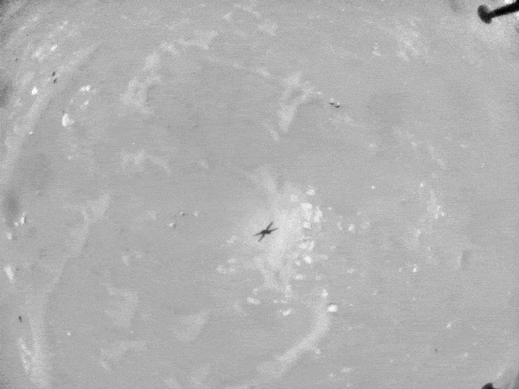

### meta info

- paragraph: 9
- word count: 745 <small>(423 if [remove all the stopwords](https://tools.fromdev.com/remove-stopwords-online.html))</small>

### translation

> 機智號無人直升機在這周進行了第六次的飛行任務，另外我們也剛剛從噴氣推進實驗室 (JPL) 得到了一些新的飛行中異常意外情況的細節：“小機靈” 最終安全地降落到了接近原目標所定的位置；但是這次遇到的軟件故障也確是讓大家深呼一口氣：大幅危險到安全降落的 20 度滾動、<u>?大量控制指令湧入</u>以及耗電量激增；好在 JPL 最終搞明白了究竟是哪裏出了問題。

> 這第六次的飛行任務對於機遇號的考驗不小，計劃是這樣的：當爬升至 10 米高度後，往西南方向飛行 150 米，然後在變向至南邊飛行 20 米的同時拍攝一些彩色的照片，最後往西北方向飛 50 米降落在一個它從未來過的一個降落台上。這次總飛行時間預計爲 140 秒，最高速度爲 4 米每秒。這次任務不僅是在挑戰機遇號的飛行能力，同時也是測試其配備的彩色相机是否能夠用於從空中拍攝立體的相片，以用於繪製火星表面的三維地圖。

> 但就在起飛 54 秒後，大致接近第一段 150 米航程的末尾時機遇號遇到了一些問題。據首席飛行員 Håvard Grip 所言，機遇號開始進行大幅近乎 20 度的前後搖動嘗試調整自己的速度，另外<u>?大量控制指令湧入</u>並且耗電量激增；機遇號在剩下的飛行中仍是顛顛簸簸，但奇跡得是它最後安全降落了，其實際降落地與目標的誤差只有僅僅五米。

> JPL 最後查清了這次異常，原因只是機遇號用於估計自己所在速度位置的一張圖片在處理流程中丟失掉了。它主要依賴於朝下的一個刷新率爲 30hz 的 VGA 相機進行單目特徵追蹤，流程是這樣的：找到不同幀里不一樣的地方，然後對比兩者判斷出之前追蹤的特徵兩者相差多遠以及其方向，這使機遇號能夠通過對比兩張圖片中不同的地方通過算法來判斷自己以多快速度要往那邊去。

> 當然，如果你能夠確保兩幀之間的時間差異沒有問題，這項技術能夠完美運行，但這恰恰是機遇號遇到出問題的地方。據 Grip 說，流程中一旦丟失任何一張圖片，之後拍攝的所有圖片都會得到錯誤的時間戳；當前導航算法還沒有強到能夠自我偵測這些問題；隨後當算法嘗試對導航圖像進行修正時，其基於的信息全是錯誤的信息。最後這些數據不對應導致用於控制飛行的數據質量大大降低，並一直嘗試在錯誤數據的基礎上修正錯誤。

> 如果這些導致了它的墜毀其實一點也不奇怪，但是機遇號最後設法還是沿着預先制定的路線繼續飛行。它之所以能夠安全着陸，多虧了它被設定爲在着陸前不再依靠視覺導航技術；這其實是 JPL 一個誤打誤撞的決定，他們只是爲了防止機翼旋轉掀起的土影響到攝影。

> 嚴格意義上來說，當機遇號完成它第一次飛行任務時，它的使命就已經結束了，現在能進行到第六次任務簡直是 <u>?好事成雙</u>。這次好消息不僅是最終的安全着陸，更是這次機遇號意料之外的嚴峻考驗給 JPL 帶來的思考；在設計下一個火星直升機時，能夠使它的適應力更強，能夠應對更多的危險情況。

> Grip 說道：
>
> > 縱觀全局，第六次任務之所以能夠成功是因爲不同子系統之間的協作：旋翼系統、传动装置以及動力系統，這些一起保證了直升機能夠繼續飛行。說實話，機遇號算是自己“闖“出了這次困境。雖然這次飛行暴露出一個迫切需要被解決的記時問題，但同時顯示出了這整個系統還是比較可靠的。
> >
> > 我們當初確實沒有計劃這麼驚險的飛行，但這次的意外也不是白白發生了，NASA 從中得到寶貴數據能夠讓機遇號再次挑戰它的能力極限。這些數據將會被仔仔細細地分析，爲我們之後在火星上飛直升機提供寶貴的經驗。

---

### footnote

1. 相關討論 on [Hacker News](https://news.ycombinator.com/item?id=27312169)
2. 機智號直升機 on [維基百科](https://zh.wikipedia.org/wiki/%E6%9C%BA%E6%99%BA%E5%8F%B7)，我自此處瞭解到了”小機靈“這個昵稱 😝
3. VGA 相機的清晰度爲 *640*x*480*

### comment

- 個人意識到的一些翻譯難點
  - _large control inputs_：後兩詞較爲容易，_large_ 這個描述詞就難翻譯了 :<

### reference

1. "_Large Control Inputs_" in [Pilot’s Handbook of Aeronautical Knowledge](https://www.faa.gov/regulations_policies/handbooks_manuals/aviation/phak/)
   > 第六章第三頁 圖例 6-5 上方
2. [Plans Underway for Ingenuity’s Sixth Flight](https://mars.nasa.gov/technology/helicopter/status/302/plans-underway-for-ingenuitys-sixth-flight/)
3. [飛行專門術語](https://blog.xuite.net/tolarku/blog/15798760)
4. [What is a flight leg and .. ?](https://aviation.stackexchange.com/questions/5185/what-is-a-flight-leg-and-why-it-is-so-important-for-an-aircraft)
5. [Does the term “leg” have a precise meaning in air-travel?](https://travel.stackexchange.com/questions/78997/does-the-term-leg-have-a-precise-meaning-in-air-travel)
6. [What is the difference between Hz and FPS?](https://www.reddit.com/r/explainlikeimfive/comments/c8d83e/eli5_what_is_the_difference_between_hz_and_fps/)
7. [「摄影」、「摄像」、「照相」这三个词在定义有什么区别？](https://archive.is/iR7Ud)
