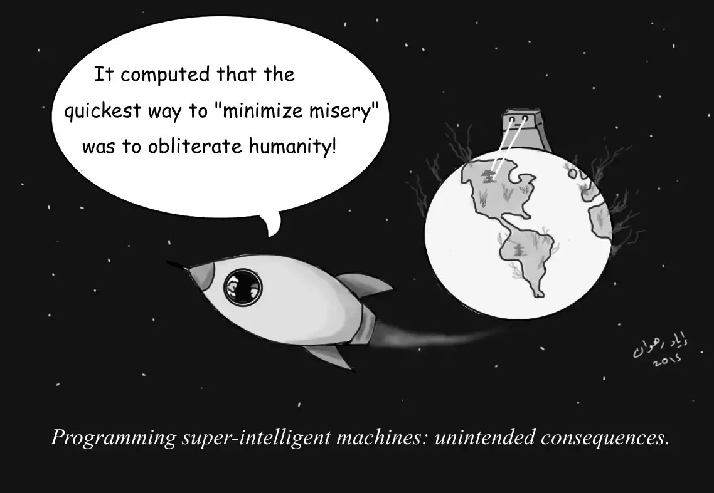

### meta info

- paragraph: 9
- word count: 656 <small>(354 if [remove all the stopwords](https://tools.fromdev.com/remove-stopwords-online.html))</small>

### translation

> 据計算機科學家估計，算法没法限制住一個可能對人類有害的人工智能。
>
> > 當我們第一次看到電腦所能做的事應該都很激動：它能控制汽車、演奏交響樂、玩危险边缘，甚至在規則錯綜複雜的象棋圍棋領域打敗人類。鑒於現在人工智能領域的進展速度，這些電腦的 “第一次” 在未來只會越來越多。有些科學家和哲學家卻嗅到了危險的氣息，如果這些進展不受控的話，一個無法被控制的超級 AI 毀滅人類完全不是天方夜譚。一個由來自各國研究者組成的小組通過理論計算得出一個冷酷的事實：我們可能完全沒有辦法控制一個超級人工智能。
> >
> > 

---

> 假設有個人開發了一個比人類還聰明并且能夠自我學習的 AI 程序：當它能夠訪問互聯網的那一刻，它就有了基本上這世界上所有的數據包括上前年人類的寶貴知識；它也許能夠代替甚至控制這世界上所有綫上的程序。這會這世界變成烏托邦還是反乌托邦？它能夠治愈癌症、給這世界帶來和平，并且組成氣候災難嗎？還是說它會毀滅掉人類並將地球歸它所有？

> 計算機科學家和哲學家們甚至質疑我們有沒有那個能力來控制它，讓它不會威脅到人類的存在。由來自各國計算機科學家組成的團隊在通過理論計算后得出：想要控制住超級人工智能完全是天方夜譚。

> 据曼努埃尔塞布赖恩 <small>Manuel Cebrian</small> 說：“一個超級聰明的人工智能控制整個世界”，這聽起來像是科幻小説裏的情節，實則不然。現在有很多電腦能夠完全獨立自主地進行對於人類特別重要的任務，但我們完全不明白它究竟是如何學會的。問題的重點在於，如果我們一直按照這個趨勢進行下去，我們會不會沒有任何辦法來控制它並阻止它傷害人類。

> 許多科學家現在有兩個關於如何控制超級人工智能的主意：第一個是限制超級人工智能自身的能力，什麽意思呢，比如限制它不能與互聯網以及其他任何電子設備連接，這樣它就沒有任何可能 “看” 到甚至 “逃” 到外部世界。但這也是個雙刃劍，沒有上面所述東西的幫助它會弱的多，在很多方面也就幫不到人類了。如果不考慮上述選項的話，我們可以嘗試讓它只做對人類有益的事，比如我們可以把道德準則通過代碼嵌入人工智能。但研究人員在綜合這些和以往的主意后，表示這些仍然不能完全避免最糟糕的情況。

> 該研究團隊構思了一種只存在理論上的“遏制算法”，它的核心目的是保證超級人工智能在任何情況下都不會傷害人類，他們在研究中先模擬人工智能可能進行的行爲，一旦它開始做一些可能對人類有害的行爲就中止它。在經過嚴密的計算分析後，他們得出一個冷冰冰的結論：以現今的計算範式，我們完全沒法實現這樣的算法。

> 伊亚德・拉赫万 <small>(Iyad Rahwan)</small> 說：如果你把這個問題具體化爲簡單的規則，你會發現算法中“不要毀滅世界”這條規則反倒會讓它沒法完成它的任務：假設這真的發生了，你完全沒法知道它究竟是還在分析潛在的威脅，還是它已經完全罷工了。如果真是這樣，那麼這個算法一點也起不到它應有的用處。

> 由上面的計算我們可以得出，實現出所謂的 ”遏制算法” 是很不切實際的。一個算法一下就判斷出一個人工智能對這個世界是否有害？不存在的！研究人員還提到，我們完全沒法判斷超級人工智能是否已經來到了這個世界，這判斷本身也是非常難解決的大問題。

> 該項研究于人工智能研究周刊發表（名爲 "_Superintelligence cannot be contained: Lessons from Computability Theory_")。其他涉及此研究的研究人员还包括来自南加州大学的安德烈・阿贝留克 <small>(Andres Abeliuk)</small>、马德里自治大学的曼努埃尔・阿方塞卡 <small>(Manuel Alfonseca)</small>、IMDEA 网络研究所的安东尼奥・费尔南德斯・安塔 <small>(Antonio Fernandez Anta)</small> 以及洛伦佐・科维洛 <small>(Lorenzo Coviello)</small>。

---

### footnote

1. en [AI](https://en.wikipedia.org/wiki/Artificial_intelligence) 即爲人工智能，全名為 _Artificial Intelligence_。
2. cn [危險邊緣](https://zh.wikipedia.org/wiki/%E5%8D%B1%E9%99%A9%E8%BE%B9%E7%BC%98)：原名為 _Jeopardy!_，于 1964 年創建的美國電視智力競賽節目。
3. 人工智能研究周刊：原名為 _Journal of Artificial Intelligence Research_，其[官方網站](https://www.jair.org/index.php/jair)
4. 考慮到讀者閲讀此文的核心目的，此部分未在譯文體現出來（均爲專有名詞，如機構或部門名稱）
   > 第一段 子段尾部  > _... , including scientists from the Center for Humans and Machines at the Max Planck Institute for Human Development, ..._\
   >
   > 第四段 尾部  > _... says study co-author Manuel Cebrian, Leader of the Digital Mobilization Group at the Center for Humans and Machines, Max Planck Institute for Human Development ..._
5. 關於倒數第三段
   > 核心在後半部分：規則很簡單，但現實世界極爲複雜，當預估本身對你來說就是黑盒的情況下，你的確完全沒辦法知道它是否還在分析潛在威脅（大致相當於一個 “沒有輸出執行進度的程序”），還是說它已經罷工了（也許是代碼有疏漏導致程序陷入無限循環，或是它耗盡了現有的硬件資源，這只是其中幾個可能性，現實中會更難分析）。

### comment

- 你現在真的需要擔心超級人工智能嗎？
  1. yes：留個心眼總沒錯。確保自己的工作不容易被替換，有真正意義上的不可替代性
  2. and no：你真正的 _敵人_ 是開發并要求付費使用 [GPT-3](https://en.wikipedia.org/wiki/GPT-3) 的 [*Open*AI](https://en.wikipedia.org/wiki/OpenAI) 進一步增加信息不對等的公司
     > GPT-3 有多强（即使需要大量的 tweak）？一句話給你概括：開源 GPT-3 的訓練數據和代碼 → 上千萬甚至近億人的失業
     >
     > You say it's _expensive_ and _dangerous_ to open source all of it? _Yeah, yeah .._
- 我不太明白 _our current paradigm of computing_ 指的是什麽 :(
  > 你（讀者）知道嗎？知道的話通過 Github 的 Issue 提出來吧！
